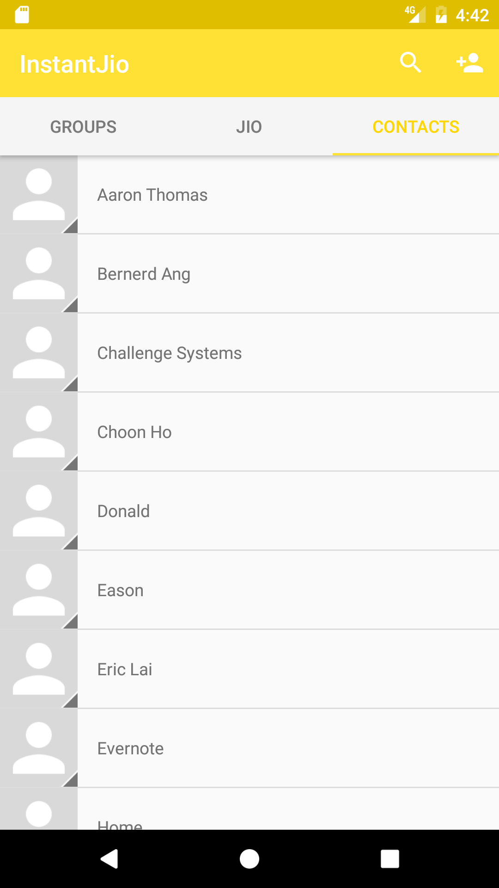
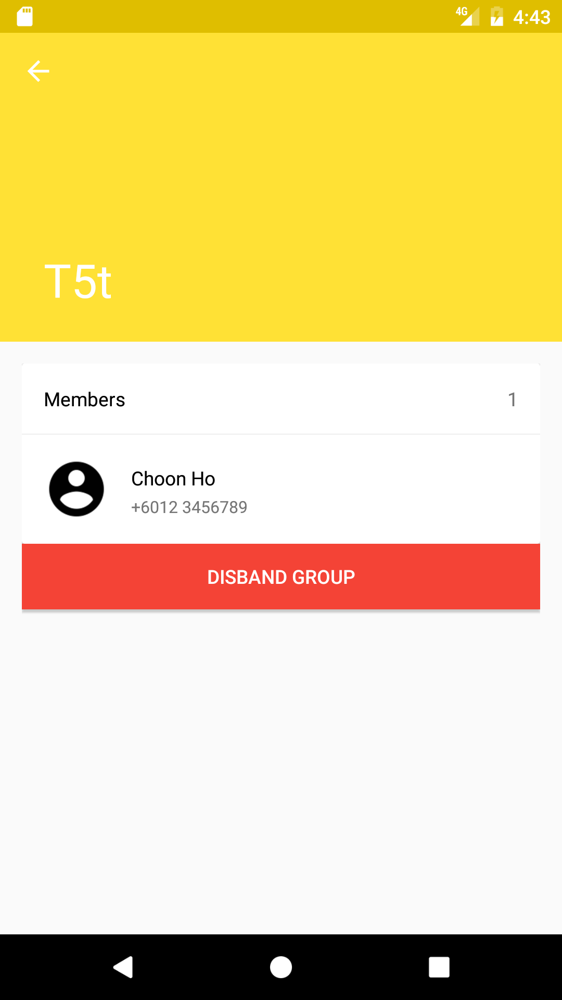
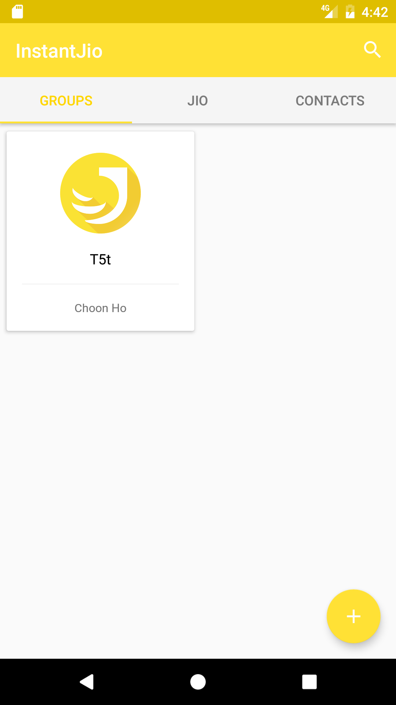

# InstantJio
An easier way to 'jio' (invite) your friends!

## How does it look like?

<table>
    <tr>
        <td></td>
        <td></td>
        <td></td>
    </tr>
    <tr>
        <td></td>
        <td></td>
        <td></td>
    </tr>
</table>

## Overview
This is a side project for us (Paperfly) to get us started to be familiar with Android application development.

The idea is a blend of WhatsApp, Eventbrite and Google Calendar, but on a smaller scale and target audience, specifically, your friends and family.

## Implemented features
1. Start a quick event* with 2 taps (3 if you count opening the app as one)
2. Create groups with your friends
3. Start an event with your friends or a group

*Quick events are events that are planned ahead by the user, that is repeatable and reusable, like a template, e.g. basketball night every Friday

## Technical documentation
### Dependencies or libaries used
1. Support library
2. Firebase (https://firebase.google.com/)
3. Google Play Services
4. Guava (https://github.com/google/guava)
5. Picasso (http://square.github.io/picasso/)
6. CircleImageView (https://github.com/hdodenhof/CircleImageView)

### Design wiki
TBC

## Disclaimer
As stated in the overview section, this project is in no way a commercial project, eventhough it will be published on Google Play Store. We don't plan to expand or scale this app in the foreseeable future.
